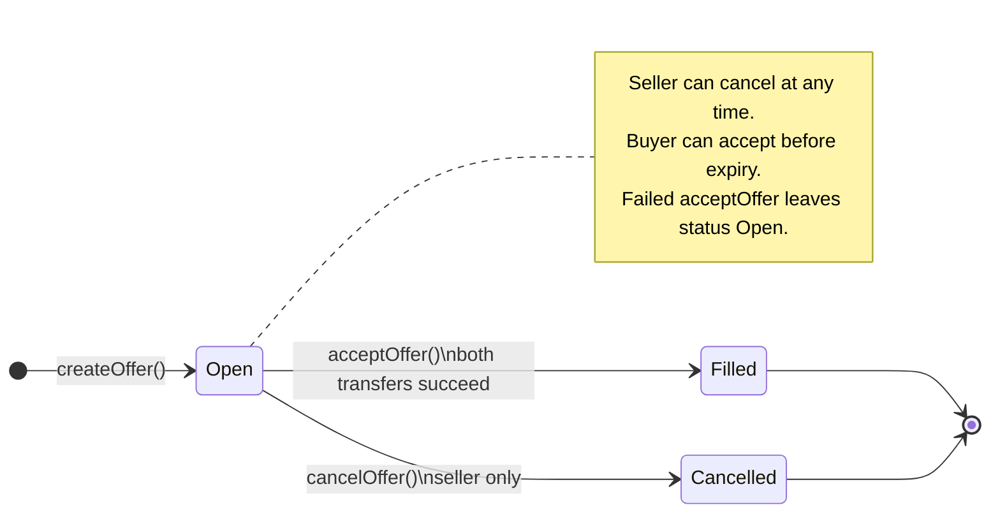
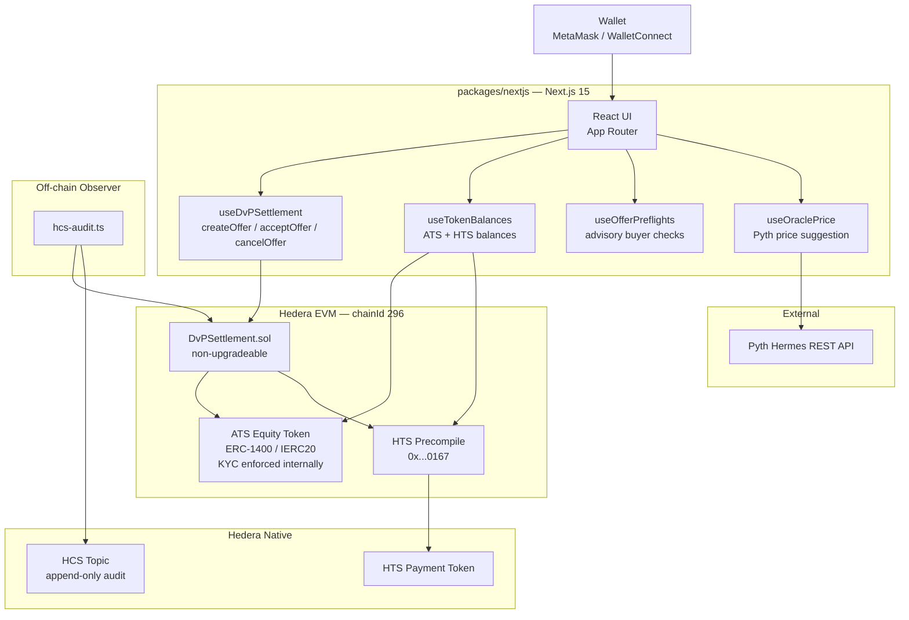

# scaffold-hbar-ats-dvp

> Atomic delivery-versus-payment for permissioned ATS security tokens on Hedera — the missing settlement primitive for compliant secondary markets.

[](https://github.com/De-real-iManuel/scaffold-hbar-ats-dvp/actions/workflows/ci.yml)

**Who this is for:** Developers adding permissioned-asset settlement to an existing Hedera application.

---

## Table of Contents

- [What it solves](#what-it-solves)
- [Settlement flow](#settlement-flow)
- [Offer lifecycle](#offer-lifecycle)
- [Repository layout](#repository-layout)
- [Quick start](#quick-start)
- [Packages](#packages)
- [Environment variables](#environment-variables)
- [Testnet deployment](#testnet-deployment)
- [Tests](#tests)
- [Hedera integrations](#hedera-integrations)
- [Supported configuration](#supported-configuration)
- [Testnet evidence](#testnet-evidence)
- [Links](#links)

---

## What it solves

| Requirement | How this template addresses it |
|---|---|
| **Atomicity** | Both token legs settle in one EVM transaction — buyer pays iff seller delivers |
| **On-chain compliance** | ATS equity token enforces KYC/eligibility inside its own `transferFrom` |
| **No escrow** | `DvPSettlement` holds no tokens — it only calls `transferFrom` on each side |
| **Non-upgradeable** | Token addresses are `immutable`; no owner, no proxy, no admin key |
| **Real ATS integration** | Script 2 calls the live ATS Factory (`0x5fA6...`) to deploy a real equity token |

---

**Scaffold it in one command.**
```bash
npm create scaffold-hbar@latest -- --template De-real-iManuel/scaffold-hbar-ats-dvp
```

---

## Settlement flow

```mermaid
sequenceDiagram
    autonumber
    participant S as Seller
    participant ATS as ATS Equity Token
    participant DVP as DvPSettlement
    participant HTS as HTS Payment Token
    participant B as Buyer

    Note over S,B: Off-chain: agree on asset amount, payment amount, expiry

    S->>ATS: approve(dvp, assetAmount)
    S->>DVP: createOffer(buyer, assetAmount, paymentAmount, expiry)
    DVP-->>S: emit OfferCreated(offerId)
    S-->>B: share offerId

    B->>HTS: approve(dvp, paymentAmount)
    B->>DVP: acceptOffer(offerId)

    rect rgb(15, 25, 48)
        Note over DVP: CHECKS — caller == buyer, status == Open, not expired
        Note over DVP: EFFECTS — status = Filled (written before any external call)
        DVP->>HTS: transferFrom(buyer, seller, paymentAmount)
        HTS-->>DVP: true
        DVP->>ATS: transferFrom(seller, buyer, assetAmount)
        Note over ATS: KYC / eligibility enforced by ATS token internally
        ATS-->>DVP: true
    end

    DVP-->>B: emit OfferSettled(offerId, seller, buyer, amounts)
    Note over S,B: Both legs committed atomically in one transaction
```



> If either `transferFrom` fails, the EVM reverts the **entire** transaction. Both legs roll back. The offer stays `Open`. No tokens move.

---

## Offer lifecycle



---

## System architecture



---

## Repository layout

```
scaffold-hbar-ats-dvp/
├── packages/
│   ├── hardhat/                          # Contracts, tests, scripts
│   │   ├── contracts/
│   │   │   ├── DvPSettlement.sol         # Production settlement contract
│   │   │   └── test/                     # Mock contracts for unit tests only
│   │   ├── deploy/
│   │   │   └── 00_deploy_dvp_settlement.ts
│   │   ├── scripts/
│   │   │   ├── hcs-audit.ts              # HCS settlement audit trail observer
│   │   │   └── setup/                    # 7-step idempotent testnet setup
│   │   │       ├── 1.validate.ts         # Check network + deployer balance
│   │   │       ├── 2.provision-ats.ts    # Deploy real ATS equity via Factory
│   │   │       ├── 3.provision-payment-token.ts  # Create HTS token
│   │   │       ├── 4.prepare-participants.ts      # Associate + KYC
│   │   │       ├── 5.deploy-settlement.ts         # Deploy DvPSettlement
│   │   │       ├── 6.grant-allowances.ts           # Approve tokens
│   │   │       └── 7.run-exchange.ts               # End-to-end demo
│   │   ├── test/
│   │   │   └── DvPSettlement.test.ts     # 44 unit tests
│   │   ├── hardhat.config.ts
│   │   └── .env.example
│   └── nextjs/                           # Next.js 15 frontend
│       ├── app/
│       │   ├── page.tsx                  # Dashboard — offer lookup + role guide
│       │   ├── create/page.tsx           # Seller: create offer
│       │   └── offer/[id]/page.tsx       # Buyer/seller: offer detail + settle
│       ├── components/
│       │   ├── OfferView.tsx             # Offer detail, actions, CEI trace
│       │   ├── CreateOfferForm.tsx       # Offer form with Pyth price suggestion
│       │   └── DashboardClient.tsx       # Offer lookup + buyer/seller guidance
│       ├── hooks/
│       │   ├── useDvPSettlement.ts       # Contract write hooks
│       │   ├── useTokenBalances.ts       # ATS + HTS balances
│       │   ├── useOfferPreflights.ts     # Advisory preflight checks
│       │   └── useOraclePrice.ts         # Pyth Network price feed
│       └── lib/
├── docs/
│   ├── architecture.md                   # Mermaid diagrams, trust model, rollback
│   ├── testnet.md                        # Step-by-step testnet walkthrough
│   └── extending.md                      # Swap tokens, replace frontend, ATS SDK
├── AGENTS.md
├── package.json
├── template.json
└── yarn.lock
```

---

## Quick start

**Requirements:** Node.js >= 20.19.0, Yarn (via corepack)

```bash
git clone https://github.com/De-real-iManuel/scaffold-hbar-ats-dvp.git
cd scaffold-hbar-ats-dvp
corepack enable && yarn install

# Run the 44-test suite — no credentials needed
yarn hardhat:test

# Start the frontend in local mode — no wallet needed
yarn next:dev
# → http://localhost:3000
```

---

## Packages

### `packages/hardhat`

| Command | Description |
|---|---|
| `yarn hardhat:test` | 44 unit tests on a local Hardhat EVM |
| `yarn hardhat:compile` | Compile Solidity + generate TypeChain types |
| `yarn typecheck` | `tsc --noEmit` |
| `yarn lint` | ESLint |

### `packages/nextjs`

| Command | Description |
|---|---|
| `yarn next:dev` | Dev server at http://localhost:3000 |
| `yarn next:build` | Production build (works with no env vars — local mode) |
| `yarn typecheck` | `tsc --noEmit` |
| `yarn lint` | `next lint` |

---

## Environment variables

### `packages/hardhat/.env`

Copy `.env.example` to `.env`. **Never commit `.env`.**

| Variable | Required | Description |
|---|---|---|
| `DEPLOYER_PRIVATE_KEY` | Yes | ECDSA key (`0x...`) with HBAR balance |
| `DEPLOYER_ACCOUNT_ID` | Script 3 | Hedera account ID (`0.0.XXXXX`) for HTS operations |
| `ATS_ADMIN_PRIVATE_KEY` | Yes | ATS token admin — deploys equity token, grants KYC |
| `SELLER_PRIVATE_KEY` | Yes | Seller participant key |
| `SELLER_ACCOUNT_ID` | Script 4 | Seller Hedera account ID |
| `BUYER_PRIVATE_KEY` | Yes | Buyer participant key |
| `BUYER_ACCOUNT_ID` | Script 4 | Buyer Hedera account ID |
| `ATS_TOKEN_ADDRESS` | Optional | Existing ATS token — script 2 skips deployment if set |
| `PAYMENT_TOKEN_ADDRESS` | Optional | Existing HTS token — script 3 skips creation if set |
| `DVP_SETTLEMENT_ADDRESS` | Set by script 5 | Deployed `DvPSettlement` address |
| `HCS_TOPIC_ID` | Optional | HCS audit topic — created on first run if unset |
| `ATS_FACTORY_ADDRESS` | Optional | Default: official testnet factory `0x5fA6...` |
| `ATS_RESOLVER_ADDRESS` | Optional | Default: official testnet resolver `0xEFEF...` |

### `packages/nextjs/.env`

| Variable | Description |
|---|---|
| `NEXT_PUBLIC_DVP_SETTLEMENT_ADDRESS` | Deployed contract address — omit for local mode |
| `NEXT_PUBLIC_ATS_TOKEN_ADDRESS` | ATS equity token EVM address |
| `NEXT_PUBLIC_PAYMENT_TOKEN_ADDRESS` | HTS payment token EVM address |
| `NEXT_PUBLIC_WC_PROJECT_ID` | WalletConnect project ID (optional) |
| `NEXT_PUBLIC_PYTH_FEED_ID` | Pyth price feed ID — default: HBAR/USD |
| `NEXT_PUBLIC_PYTH_API_KEY` | Pyth API key (optional) |

---

## Testnet deployment

Full walkthrough: [docs/testnet.md](docs/testnet.md)

Get funded accounts from [portal.hedera.com](https://portal.hedera.com/register), fill in `packages/hardhat/.env`, then:

```bash
cd packages/hardhat

# Linux / Mac
npx hardhat run scripts/setup/1.validate.ts --network hederaTestnet
npx hardhat run scripts/setup/2.provision-ats.ts --network hederaTestnet
npx hardhat run scripts/setup/3.provision-payment-token.ts --network hederaTestnet
npx hardhat run scripts/setup/4.prepare-participants.ts --network hederaTestnet
npx hardhat run scripts/setup/5.deploy-settlement.ts --network hederaTestnet
npx hardhat run scripts/setup/6.grant-allowances.ts --network hederaTestnet
npx hardhat run scripts/setup/7.run-exchange.ts --network hederaTestnet
```

> **Windows:** Replace `npx hardhat run` with `node node_modules/hardhat/internal/cli/bootstrap.js run` — see [AGENTS.md](AGENTS.md).

Script 2 deploys a **real ATS equity token** via the official ATS Factory at `0x5fA65CA30d1984701F10476664327f97c864A9D3` (Hedera Testnet v4.0.0), with `internalKycActivated: true`. If the factory call fails, it falls back to `MockATSToken` automatically and reports which path was taken.

Each script is idempotent — re-running skips completed steps. After script 5, update `packages/nextjs/.env` with the deployed addresses.

---

## Tests

```bash
yarn hardhat:test   # Expected: 44 passing (~7s)
```

| Suite | Tests | Covers |
|---|---|---|
| Constructor | 4 | Zero-address, same-address, immutable storage |
| `createOffer` | 8 | Input validation, sequential IDs, events |
| `cancelOffer` | 5 | Seller-only, terminal state rejection |
| Authorization | 4 | Buyer-only acceptance, Filled/Cancelled rejection |
| Expiry | 3 | Exact boundary at expiry timestamp |
| Allowance / Balance | 6 | Insufficient allowance and balance on both legs |
| Happy Path | 4 | Exact balance changes, Filled status, `OfferSettled` |
| ATS Failure | 4 | KYC revocation, pause, full rollback |
| Atomicity | 2 | Status rollback, no partial balance change |
| Reentrancy | 1 | `MaliciousToken` blocked by `ReentrancyGuard` |
| False-Return | 2 | `false` return on payment and asset legs |
| **Total** | **44** | |

---

## Hedera integrations

### 1. Asset Tokenization Studio — asset leg (load-bearing)

Script 2 calls `Factory.deployEquity()` on the live ATS Factory contract at `0x5fA65CA30d1984701F10476664327f97c864A9D3`. The deployed equity token has `internalKycActivated: true`, meaning its `transferFrom` reverts if the buyer lacks KYC eligibility — enforcing compliance without the settlement contract needing any knowledge of compliance rules.

ATS factory addresses (Hedera Testnet v4.0.0):

| Contract | EVM Address |
|---|---|
| Factory Proxy | `0x5fA65CA30d1984701F10476664327f97c864A9D3` |
| BLR Proxy (resolver) | `0xEFEF4CAe9642631Cfc6d997D6207Ee48fa78fe42` |

### 2. Hedera Token Service — payment leg

The payment token is a native HTS fungible token created via `@hashgraph/sdk` `TokenCreateTransaction`. It is accessed from Solidity via the HTS precompile at `0x0000000000000000000000000000000000000167`. HTS provides Hedera-native finality (~3 s) and predictable sub-cent fees. Buyers must associate the token before receiving it (script 4).

### 3. Pyth Network oracle — price suggestion

`hooks/useOraclePrice.ts` fetches the current price from [Pyth Hermes](https://hermes.pyth.network) and displays an advisory suggested payment amount in the seller form. Advisory only — the contract enforces no pricing. Configurable via `NEXT_PUBLIC_PYTH_FEED_ID`.

### 4. Hedera Consensus Service — settlement audit trail

`scripts/hcs-audit.ts` polls for `OfferSettled` events and submits tamper-evident JSON records to an append-only HCS topic. Composes EVM smart contracts with HCS immutable logging — no contract changes needed.

---

## Supported configuration

| Token | Type | Requirements |
|---|---|---|
| ATS equity token | ERC-1400 / ERC-20-compatible smart contract | Default partition, KYC enabled, `transferFrom` via allowance |
| Payment token | Native HTS fungible token | No custom fees, no rebasing |

**Not supported:** ATS protected partitions, globally paused tokens, HTS custom fee schedules, rebasing tokens, native HBAR as payment, ERC-721.

See [docs/extending.md](docs/extending.md) to swap the token pair or replace the frontend.

---

## Testnet evidence

| Item | Value |
|---|---|
| `DvPSettlement` | [`0x20308700CcF4a22db4b05E8E4Cc4Ff7c72176D51`](https://hashscan.io/testnet/contract/0x20308700CcF4a22db4b05E8E4Cc4Ff7c72176D51) |
| ATS demo token | [`0xEDdD1903D24E26A84E2AEeFf08909b9D024574E6`](https://hashscan.io/testnet/contract/0xEDdD1903D24E26A84E2AEeFf08909b9D024574E6) |
| HTS payment token | [`0.0.10816685`](https://hashscan.io/testnet/token/0.0.10816685) |
| Settlement tx | [`0x317c3c17e80a392bbab7732e6eb8bc21aee0fb797307017c72bd6b249196e02b`](https://hashscan.io/testnet/transaction/0x317c3c17e80a392bbab7732e6eb8bc21aee0fb797307017c72bd6b249196e02b) |

Verified: 100 DATS exchanged for 50 DVPPAY atomically. KYC revocation and wrong-buyer rejection both verified on-chain.

---

## Links

| | |
|---|---|
| Architecture | [docs/architecture.md](docs/architecture.md) |
| Testnet setup | [docs/testnet.md](docs/testnet.md) |
| Extending | [docs/extending.md](docs/extending.md) |
| AI agent context | [AGENTS.md](AGENTS.md) |
| Scaffold-HBAR | https://docs.hedera.com/solutions/tools/scaffold-hbar |
| ATS docs | https://docs.tokenization-studio.hedera.com |
| ATS deployed addresses | https://docs.tokenization-studio.hedera.com/ats/developer-guides/contracts/deployed-addresses |
| HashScan testnet | https://hashscan.io/testnet |

---

## License

[MIT](LICENSE)
