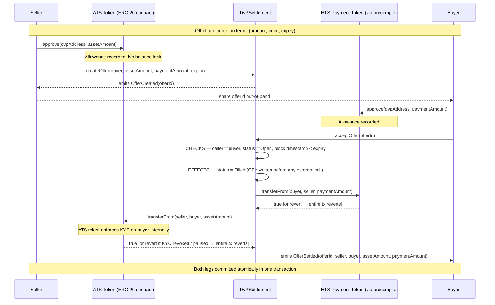

# ATS Delivery versus Payment — Scaffold-HBAR Template

A Scaffold-HBAR template that implements bilateral delivery-versus-payment (DvP) settlement on Hedera. The core of the template is a reusable settlement primitive — `DvPSettlement` — that atomically swaps a permissioned ATS security token for an HTS payment token in a single EVM transaction. The ATS/DvP use case is the demonstration domain; the settlement architecture is the reusable artifact.

---

## Why this template?

Most token-transfer examples hand you a single `transferFrom`. That is sufficient for simple swaps but not for secondary-market settlement of regulated assets, which requires:

- **Atomicity** — buyer pays if and only if seller delivers. No partial fills. No stuck funds.
- **Permissioned assets** — KYC/eligibility enforced by the asset token itself at transfer time, not by an off-chain gate you must maintain separately.
- **No escrow** — tokens never sit in the settlement contract. One transaction, two transfers, done.

`DvPSettlement` is that primitive. It is non-upgradeable, has no admin key, and delegates all compliance logic to the tokens it settles. If either transfer leg fails for any reason — KYC revoked, token paused, insufficient balance, expired offer — the entire EVM transaction reverts and neither party loses anything.

The template is structured so you can keep the settlement contract unchanged and replace the asset domain (ATS security token → your token type) and the payment domain (HTS fungible token → your payment token) independently.

---

## What you can build with it

The settlement pattern is not specific to ATS securities. Any bilateral asset-for-payment exchange where both legs must succeed or both must fail can use this architecture:

- Tokenized securities secondary market
- OTC trade settlement
- Invoice factoring (invoice token vs. stablecoin)
- Commodity delivery receipts vs. payment
- Escrow-style bilateral agreements
- Institutional asset settlement between two known counterparties

See [Adapting the Template](#adapting-the-template) for what changes and what stays the same in each case.

---

## Architecture

The repository is a Yarn monorepo with two packages:

```
packages/
  hardhat/    — Solidity contract, tests, deployment scripts, setup scripts
  nextjs/     — Next.js 15 frontend (wagmi + RainbowKit, Hedera Testnet)
```

The layered architecture derived from the code:

```
Browser / Wallet (MetaMask, WalletConnect)
        ↓
Next.js frontend — wagmi hooks, RainbowKit
        ↓
useDvPSettlement / useOfferPreflights / useTokenBalances
        ↓
DvPSettlement.sol — offer lifecycle + atomic settlement
        ↓  ↓
ATS Token          HTS Payment Token
(ERC-20 contract   (native HTS fungible token,
 on Hedera EVM)     accessed via HTS precompile
                    at 0x...0167)
        ↓  ↓
Hedera EVM (chainId 296 testnet / 295 mainnet)
```

`DvPSettlement` holds no tokens. It acts as a trusted intermediary that calls `transferFrom` on both token contracts inside a single EVM transaction. EVM atomicity guarantees that either both calls succeed and are committed, or the entire transaction reverts.

---

## How DvP works



If either `transferFrom` reverts or returns `false`, the EVM reverts the entire transaction. The `require()` guards on both return values mean a false-returning token (one that signals failure without reverting) is also caught. The offer status write to `Filled` is also rolled back, leaving the offer `Open`.

---

## Hedera integration

Hedera is not used here as a generic EVM host. Two Hedera-specific capabilities are load-bearing parts of the architecture.

### Hedera Token Service (HTS) — payment leg

The payment token is a native HTS fungible token, not an ERC-20 contract. HTS tokens are accessible from Solidity via the HTS precompile at `0x0000000000000000000000000000000000000167`. The precompile exposes an IERC20-compatible interface, so `DvPSettlement` calls `transferFrom` on it identically to any ERC-20.

What HTS provides that a plain ERC-20 does not:
- Native Hedera finality (~3 seconds, deterministic)
- Predictable, sub-cent transaction fees with no MEV
- Token creation via `@hashgraph/sdk` (script 3 uses `TokenCreateTransaction`)
- HTS account association requirement — buyers must associate the token with their Hedera account before receiving it (script 4)

The EVM address of an HTS token is derived from its token ID: `0x` + zero-padded hex of the token number. For example, token `0.0.10816685` has EVM address `0x0000000000000000000000000000000000a50cad`.

### Asset Tokenization Studio (ATS) — asset leg

The ATS asset is an ERC-1400-compatible smart contract deployed on Hedera EVM. It is not a native HTS token. ATS tokens enforce KYC/eligibility inside their own `transferFrom` implementation — if the buyer (`to` address) lacks eligibility, `transferFrom` reverts.

`DvPSettlement` does not implement any eligibility logic. It calls `atsAsset.transferFrom(seller, buyer, assetAmount)` and relies on the ATS token to enforce compliance. This means:
- Compliance rules live in the asset token, not in the settlement contract.
- The settlement contract does not need to be redeployed when compliance rules change.
- If KYC is revoked after an offer is created but before it is accepted, the settlement reverts automatically.


### Pyth Network oracle — market price suggestion

`hooks/useOraclePrice.ts` fetches the current HBAR/USD price from the [Pyth Hermes REST API](https://hermes.pyth.network) and displays an advisory suggested payment amount in `CreateOfferForm` as the seller types. The oracle is read-only and advisory — the contract enforces nothing about pricing, and the form remains fully submittable if the oracle is unavailable or stale.

The price feed is configurable: set `NEXT_PUBLIC_PYTH_FEED_ID` to any [Pyth-supported price feed ID](https://pyth.network/developers/price-feed-ids). All price computation uses `bigint` arithmetic only — no floating-point on token amounts.
### Hedera Consensus Service — settlement audit trail

`scripts/hcs-audit.ts` polls the deployed `DvPSettlement` contract for `OfferSettled` events and submits a tamper-evident JSON record to an append-only HCS topic after each settlement. This composes two native Hedera services — EVM smart contracts and HCS — without modifying the contract.

```bash
# From packages/hardhat — run after script 7
node node_modules/hardhat/internal/cli/bootstrap.js run scripts/hcs-audit.ts --network hederaTestnet
```

Each HCS message records: offer ID, seller, buyer, asset amount, payment amount, settlement tx hash, and ISO timestamp. The topic has no admin key — messages cannot be deleted or altered.

### What Hedera does NOT provide here

- The Mirror Node is not queried by the contracts or frontend hooks.
- No Hedera-specific precompile other than the HTS token precompile is called.
- The frontend connects to Hedera Testnet via the standard JSON-RPC endpoint (`https://testnet.hashio.io/api`), the same way any EVM-compatible frontend would.

---

## Contract architecture

There is one production contract: `DvPSettlement.sol`.

```solidity
contract DvPSettlement is ReentrancyGuard {
    IERC20 public immutable atsAsset;
    IERC20 public immutable paymentToken;

    enum OfferStatus { Open, Filled, Cancelled }

    struct Offer {
        uint256 id;
        address seller;
        address buyer;
        uint256 assetAmount;
        uint256 paymentAmount;
        uint256 expiry;
        OfferStatus status;
    }

    mapping(uint256 => Offer) public offers;

    function createOffer(address buyer, uint256 assetAmount, uint256 paymentAmount, uint256 expiry) external returns (uint256 offerId);
    function cancelOffer(uint256 offerId) external;
    function acceptOffer(uint256 offerId) external nonReentrant;
}
```

Key design properties:
- Both token addresses are `immutable` — set at construction, never changeable.
- No owner, no admin, no upgrade proxy. The contract has no privileged role after deployment.
- `acceptOffer` uses the Checks-Effects-Interactions (CEI) pattern: offer status is written to `Filled` before any external call.
- `nonReentrant` on `acceptOffer` provides defence-in-depth against reentrancy even if a malicious token attempts a reentrant call.
- Both `transferFrom` return values are checked with `require()` — tokens that return `false` instead of reverting are handled correctly.

Four test-only contracts exist in `contracts/test/`:
- `MockERC20` — standard ERC-20 with a `mint` helper
- `MockATSToken` — extends MockERC20 with configurable KYC blocking and pause simulation
- `MaliciousToken` — attempts a reentrant `acceptOffer` call during `transferFrom`
- `FalseReturnToken` — `transferFrom` always returns `false` without reverting

---

## Settlement lifecycle

The `OfferStatus` enum defines the complete state machine:

```
                    createOffer()
                         │
                         ▼
                      [ Open ]
                     /        \
          acceptOffer()      cancelOffer()
               │                  │
               ▼                  ▼
           [ Filled ]        [ Cancelled ]
```

Terminal states: `Filled` and `Cancelled`. Neither can transition further.

Failure paths during `acceptOffer`:

| Failure condition | Result |
|---|---|
| Caller is not the designated buyer | Reverts: `"not buyer"` |
| Offer is not `Open` | Reverts: `"not open"` |
| `block.timestamp >= expiry` | Reverts: `"expired"` |
| Payment `transferFrom` reverts | Entire tx reverts. Status rolls back to `Open`. |
| Payment `transferFrom` returns `false` | `require(paymentOk)` fails. Entire tx reverts. |
| Asset `transferFrom` reverts (KYC, pause) | Entire tx reverts. Payment transfer rolled back. Status rolls back to `Open`. |
| Asset `transferFrom` returns `false` | `require(assetOk)` fails. Entire tx reverts. Payment rolled back. |

In every failure case: no tokens move, offer status remains `Open`, offer can be retried or cancelled.

---

## Reusable components

| Component | Responsibility | Reusable as-is? | How to extend |
|---|---|---|---|
| `DvPSettlement.sol` | Offer lifecycle + atomic two-leg settlement | Yes — deploy with any IERC20-compatible token pair | Deploy a new instance with different constructor args |
| `deploy/00_deploy_dvp_settlement.ts` | hardhat-deploy script; auto-deploys mock tokens locally | Yes | Update env vars; mock token deployment is automatic on local network |
| `scripts/setup/1.validate.ts` | Validates network, chain ID, deployer balance | Yes | Extend with additional preflight checks |
| `scripts/setup/3.provision-payment-token.ts` | Creates HTS fungible token via `@hashgraph/sdk` | Yes | Change token name/symbol/decimals/supply |
| `scripts/setup/5.deploy-settlement.ts` | Deploys `DvPSettlement` with token addresses from state | Yes | No changes needed |
| `scripts/setup/6.grant-allowances.ts` | Grants ERC-20 allowances from seller and buyer | Yes | Adjust amounts |
| `scripts/setup/7.run-exchange.ts` | Runs happy-path and rejection scenarios end-to-end | Yes | Add more scenarios |
| `hooks/useDvPSettlement.ts` | wagmi wrapper for `createOffer`, `acceptOffer`, `cancelOffer` | Yes | Replace ABI inline or import from generated typechain |
| `hooks/useOfferPreflights.ts` | Reads buyer payment allowance and balance | Yes | Add ATS eligibility read if ATS SDK exposes it |
| `hooks/useTokenBalances.ts` | Reads ATS and payment token balances for connected wallet | Yes | Add more tokens |
| `lib/contracts.ts` | Resolves contract addresses from env or local deployment | Yes | Add more contract address resolvers |
| `lib/wagmiConfig.ts` | wagmi + RainbowKit config for Hedera Testnet (chainId 296) | Yes | Add mainnet chain (chainId 295) |
| `components/OfferView.tsx` | Full offer detail + approve + accept/cancel UI | Partial | Replace or extend for your UX |
| `components/CreateOfferForm.tsx` | Seller offer creation form | Partial | Replace for your asset/payment fields |
| `MockATSToken.sol` | Simulates ATS KYC/pause for testing | Test only | Replace with real ATS token on testnet |
| `MockERC20.sol` | Standard ERC-20 for local testing | Test only | Replace with real HTS token on testnet |

---

## Project structure

```
scaffold-hbar-ats-dvp/
├── packages/
│   ├── hardhat/
│   │   ├── contracts/
│   │   │   ├── DvPSettlement.sol          # Production contract
│   │   │   └── test/
│   │   │       ├── MockATSToken.sol        # KYC simulation for tests
│   │   │       ├── MockERC20.sol           # Standard ERC-20 for tests
│   │   │       ├── MaliciousToken.sol      # Reentrancy test helper
│   │   │       └── FalseReturnToken.sol    # False-return test helper
│   │   ├── deploy/
│   │   │   └── 00_deploy_dvp_settlement.ts # hardhat-deploy script
│   │   ├── deployments/
│   │   │   └── hederaTestnet/
│   │   │       └── DvPSettlement.json      # Deployed address + ABI
│   │   ├── scripts/
│   │   │   ├── hcs-audit.ts                # HCS settlement audit trail observer
│   │   │   └── setup/
│   │   │       ├── 1.validate.ts           # Check network + balance
│   │   │       ├── 2.provision-ats.ts      # Deploy/record ATS token
│   │   │       ├── 3.provision-payment-token.ts  # Create HTS token
│   │   │       ├── 4.prepare-participants.ts     # Associate + KYC
│   │   │       ├── 5.deploy-settlement.ts  # Deploy DvPSettlement
│   │   │       ├── 6.grant-allowances.ts   # Approve tokens
│   │   │       └── 7.run-exchange.ts       # End-to-end demo
│   │   ├── test/
│   │   │   └── DvPSettlement.test.ts       # 44 unit tests
│   │   ├── hardhat.config.ts
│   │   └── .env.example
│   └── nextjs/
│       ├── app/
│       │   ├── page.tsx                    # Dashboard / home
│       │   ├── create/page.tsx             # Seller offer creation
│       │   └── offer/[id]/page.tsx         # Offer detail + settlement
│       ├── components/
│       │   ├── OfferView.tsx               # Full offer UI + CEI trace
│       │   ├── CreateOfferForm.tsx         # Offer creation form
│       │   ├── DashboardClient.tsx         # Offer lookup + positions
│       │   ├── NetworkGuard.tsx            # Chain ID 296 guard
│       │   └── TokenBalances.tsx           # Wallet balance display
│       ├── hooks/
│       │   ├── useDvPSettlement.ts         # createOffer/acceptOffer/cancelOffer
│       │   ├── useOfferPreflights.ts       # Buyer allowance + balance checks
│       │   └── useTokenBalances.ts         # ATS + payment balances
│       ├── lib/
│       │   ├── contracts.ts                # Address resolution (env or local)
│       │   ├── wagmiConfig.ts              # Hedera Testnet chain + RainbowKit
│       │   └── formatters.ts               # Token amount + expiry formatting
│       ├── contracts/
│       │   └── deployedContracts.ts        # Auto-generated by generateTsAbis
│       └── .env.example
├── docs/
│   ├── architecture.md                     # Mermaid diagram, trust model, rollback
│   ├── extending.md                        # Token pair swap, frontend replacement
│   └── testnet.md                          # Script-by-script testnet walkthrough
├── package.json                            # Workspace root scripts
└── README.md
```

---

## Quick start

**Requirements:** Node.js >= 20.19.0, Yarn (via corepack)

```bash
corepack enable && corepack prepare yarn@stable --activate
git clone <repo-url>
cd scaffold-hbar-ats-dvp
yarn install
```

### Run the test suite (no credentials needed)

```bash
yarn hardhat:test
```

Expected output:

```
DvPSettlement
  Constructor
    ✓ reverts when atsAsset is the zero address
    ✓ reverts when paymentToken is the zero address
    ✓ reverts when both addresses are identical
    ✓ stores immutable addresses on valid deployment
  createOffer
    ✓ reverts when buyer is the zero address
    ... (8 tests)
  cancelOffer
    ... (5 tests)
  acceptOffer — Authorization
    ... (4 tests)
  acceptOffer — Expiry
    ... (3 tests)
  acceptOffer — Allowance and Balance
    ... (6 tests)
  acceptOffer — Happy Path
    ... (4 tests)
  acceptOffer — ATS Failure Scenarios
    ... (4 tests)
  acceptOffer — Atomicity
    ... (2 tests)
  Reentrancy
    ✓ reverts reentrant acceptOffer via MaliciousToken
  False-Return Token
    ✓ reverts when payment token transferFrom returns false
    ✓ reverts when ATS asset transferFrom returns false

44 passing
```

### Run the frontend in local mode

```bash
yarn next:dev
# Open http://localhost:3000
# The yellow "Local Mode" banner confirms no testnet connection is required.
```

In local mode, `lib/contracts.ts` falls back to addresses from `deployedContracts.ts`. Run `yarn hardhat:compile` and then deploy locally first if you want live contract reads:

```bash
yarn hardhat:compile
# From packages/hardhat:
npx hardhat deploy --network hardhat
```

---

## Configuration

### `packages/hardhat/.env`

Copy `.env.example` to `.env` and fill in values. Never commit `.env`.

| Variable | Required | Description |
|---|---|---|
| `DEPLOYER_PRIVATE_KEY` | Yes | ECDSA private key (with `0x` prefix) for the deployer account. Must have HBAR balance. |
| `DEPLOYER_ACCOUNT_ID` | Yes (script 3) | Hedera account ID (`0.0.XXXXX`) for the deployer. Required for HTS token creation. |
| `ATS_ADMIN_PRIVATE_KEY` | Yes | Private key for the ATS token administrator. Used to grant KYC eligibility. |
| `SELLER_PRIVATE_KEY` | Yes | Private key for the seller participant. |
| `SELLER_ACCOUNT_ID` | Yes (script 4) | Hedera account ID for the seller. |
| `BUYER_PRIVATE_KEY` | Yes | Private key for the buyer participant. |
| `BUYER_ACCOUNT_ID` | Yes (script 4) | Hedera account ID for the buyer. |
| `ATS_TOKEN_ADDRESS` | Optional | EVM address of an existing ATS token. If set, script 2 skips deployment. |
| `PAYMENT_TOKEN_ADDRESS` | Optional | EVM address of an existing HTS payment token. If set, script 3 skips creation. |
| `DVP_SETTLEMENT_ADDRESS` | Set by script 5 | EVM address of the deployed `DvPSettlement` contract. |
| `HEDERA_RPC_URL` | Optional | Override the default `https://testnet.hashio.io/api`. |
| `ATS_FACTORY_ADDRESS` | Optional | ATS factory EVM address, if using a real ATS deployment. |
| `ATS_RESOLVER_ADDRESS` | Optional | ATS resolver EVM address, if using a real ATS deployment. |
| `HCS_TOPIC_ID` | Optional | HCS topic ID (`0.0.XXXXX`) for the settlement audit trail. If unset, `hcs-audit.ts` creates a new append-only topic on first run. |

### `packages/nextjs/.env`

Copy `.env.example` to `.env`.

| Variable | Required | Client-side? | Description |
|---|---|---|---|
| `NEXT_PUBLIC_DVP_SETTLEMENT_ADDRESS` | Yes (testnet) | Yes | EVM address of deployed `DvPSettlement`. Leave empty for local mode. |
| `NEXT_PUBLIC_ATS_TOKEN_ADDRESS` | Yes (testnet) | Yes | EVM address of the ATS asset token. |
| `NEXT_PUBLIC_PAYMENT_TOKEN_ADDRESS` | Yes (testnet) | Yes | EVM address of the HTS payment token. |
| `NEXT_PUBLIC_WC_PROJECT_ID` | Optional | Yes | WalletConnect project ID from [cloud.walletconnect.com](https://cloud.walletconnect.com). Required for HashPack and Blade wallets. MetaMask works without it. |

All `NEXT_PUBLIC_` variables are embedded in the browser bundle. Do not put private keys or secrets in these variables.

---

## Deploying to Hedera Testnet

Full walkthrough: [docs/testnet.md](docs/testnet.md)

Get three funded Hedera Testnet accounts from [portal.hedera.com](https://portal.hedera.com/register). Each account needs HBAR for gas.

Run the seven setup scripts in order from `packages/hardhat`. Each script is idempotent — re-running skips completed steps. State is persisted in `scripts/setup/setup-state.json`.

**Windows:**
```bash
cd packages/hardhat
node node_modules/hardhat/internal/cli/bootstrap.js run scripts/setup/1.validate.ts --network hederaTestnet
node node_modules/hardhat/internal/cli/bootstrap.js run scripts/setup/2.provision-ats.ts --network hederaTestnet
node node_modules/hardhat/internal/cli/bootstrap.js run scripts/setup/3.provision-payment-token.ts --network hederaTestnet
node node_modules/hardhat/internal/cli/bootstrap.js run scripts/setup/4.prepare-participants.ts --network hederaTestnet
node node_modules/hardhat/internal/cli/bootstrap.js run scripts/setup/5.deploy-settlement.ts --network hederaTestnet
node node_modules/hardhat/internal/cli/bootstrap.js run scripts/setup/6.grant-allowances.ts --network hederaTestnet
node node_modules/hardhat/internal/cli/bootstrap.js run scripts/setup/7.run-exchange.ts --network hederaTestnet
```

**Linux / Mac:**
```bash
cd packages/hardhat
npx hardhat run scripts/setup/1.validate.ts --network hederaTestnet
npx hardhat run scripts/setup/2.provision-ats.ts --network hederaTestnet
npx hardhat run scripts/setup/3.provision-payment-token.ts --network hederaTestnet
npx hardhat run scripts/setup/4.prepare-participants.ts --network hederaTestnet
npx hardhat run scripts/setup/5.deploy-settlement.ts --network hederaTestnet
npx hardhat run scripts/setup/6.grant-allowances.ts --network hederaTestnet
npx hardhat run scripts/setup/7.run-exchange.ts --network hederaTestnet
```

After script 5, copy the deployed address into `packages/nextjs/.env`:
```
NEXT_PUBLIC_DVP_SETTLEMENT_ADDRESS=0x...
NEXT_PUBLIC_ATS_TOKEN_ADDRESS=0x...
NEXT_PUBLIC_PAYMENT_TOKEN_ADDRESS=0x...
```

Alternatively, use `hardhat-deploy` directly:
```bash
# From packages/hardhat
npx hardhat deploy --network hederaTestnet
```

This runs `deploy/00_deploy_dvp_settlement.ts` and calls `generateTsAbis` to write the ABI to `packages/nextjs/contracts/deployedContracts.ts`.

**Gas price note:** Hedera Testnet requires a minimum gas price of 870 Gwei. The hardhat config sets `gasPrice: 900_000_000_000` (900 Gwei). The setup scripts use the same value.

---

## Testing

The test suite is in `packages/hardhat/test/DvPSettlement.test.ts`. All 44 tests run against a local Hardhat EVM using mock tokens — no testnet credentials or HBAR required.

```bash
yarn hardhat:test
# or from packages/hardhat:
npx hardhat test
```

Test coverage by category:

| Category | Tests | What is verified |
|---|---|---|
| Constructor | 4 | Zero address rejection, identical address rejection, immutable storage |
| createOffer | 8 | Input validation, sequential IDs, correct field storage, OfferCreated event |
| cancelOffer | 5 | Seller-only access, terminal state rejection, status update, OfferCancelled event |
| acceptOffer — Authorization | 4 | Buyer-only access, Filled/Cancelled rejection |
| acceptOffer — Expiry | 3 | Boundary conditions at expiry timestamp |
| acceptOffer — Allowance/Balance | 6 | Insufficient allowance and balance on both legs |
| acceptOffer — Happy Path | 4 | Exact balance changes, status update, OfferSettled event |
| ATS Failure Scenarios | 4 | KYC revocation, token pause, full balance rollback on failure |
| Atomicity | 2 | Status rollback on failure, no partial balance change |
| Reentrancy | 1 | MaliciousToken reentrant call blocked by ReentrancyGuard |
| False-Return Token | 2 | False return on payment leg, false return on asset leg |

---

## Adapting the template

The settlement contract is intentionally decoupled from the asset domain. `DvPSettlement` only knows two things: the address of the asset token and the address of the payment token. Everything else — what the asset represents, what compliance rules apply, what the payment currency is — lives in the tokens themselves.

To adapt the template, you deploy a new `DvPSettlement` instance with different constructor arguments. The contract code does not change.

### Swap the asset token

| Use case | Asset token | What changes | What stays the same |
|---|---|---|---|
| ATS security token (demo) | `MockATSToken` / real ATS token | Nothing — this is the default | Everything |
| Real ATS equity/bond | ATS token from Asset Tokenization Studio | `ATS_TOKEN_ADDRESS` env var | `DvPSettlement.sol`, all scripts, frontend hooks |
| Plain ERC-20 asset | Any IERC20-compatible contract | `ATS_TOKEN_ADDRESS` env var; remove KYC-specific UI notes | `DvPSettlement.sol` unchanged |
| NFT (ERC-721) | Not supported — requires different transfer interface | Would need a new settlement contract | Settlement pattern, payment leg |
| Wrapped real-world asset | Any IERC20-compatible wrapper | `ATS_TOKEN_ADDRESS` env var | Everything else |

> To replace MockATSToken with a real ATS equity or bond token, see [docs/extending.md — Upgrading to a Real ATS Token](docs/extending.md#upgrading-to-a-real-ats-token).

### Swap the payment token

| Use case | Payment token | What changes | What stays the same |
|---|---|---|---|
| HTS fungible token (demo) | Native HTS token via precompile | Nothing — this is the default | Everything |
| USDC on Hedera | USDC HTS token address | `PAYMENT_TOKEN_ADDRESS` env var | `DvPSettlement.sol` unchanged |
| Any ERC-20 stablecoin | Any IERC20-compatible token | `PAYMENT_TOKEN_ADDRESS` env var | Everything else |
| HBAR (native currency) | Not supported — requires `msg.value` path | Would need a new settlement contract | Settlement pattern, asset leg |

### Swap both

Deploy a new `DvPSettlement` with your token pair:

```typescript
const dvp = await DvPFactory.deploy(
  "0xYOUR_ASSET_TOKEN_ADDRESS",
  "0xYOUR_PAYMENT_TOKEN_ADDRESS"
);
```

Update both `.env` files with the new addresses. The frontend, hooks, and scripts all read addresses from environment variables and require no code changes.

### Replace the frontend

The frontend is a thin wagmi layer over three contract functions. The full ABI is in `hooks/useDvPSettlement.ts`. Any framework that can call EVM contracts works:

```typescript
// The only contract interface you need:
createOffer(buyer, assetAmount, paymentAmount, expiry) → offerId
cancelOffer(offerId)
acceptOffer(offerId)
offers(offerId) → { id, seller, buyer, assetAmount, paymentAmount, expiry, status }
```

Events: `OfferCreated`, `OfferSettled`, `OfferCancelled`.

### Extension points summary

```
Your asset token (any IERC20-compatible)
          ↓
    DvPSettlement.sol          ← keep this unchanged
          ↓
Your payment token (any IERC20-compatible)
```

The settlement contract is the stable core. Replace the tokens around it.

---

## Architecture decisions

### Token addresses are immutable constructor arguments

**What was chosen:** `atsAsset` and `paymentToken` are stored as `immutable` and set only in the constructor. No function can change them after deployment.

**Context:** A settlement contract that can have its token addresses changed post-deployment is a different security model — it requires trusting whoever controls the admin key.

**Rationale:** Immutability removes the admin key attack surface entirely. A deployed `DvPSettlement` instance settles exactly the token pair it was deployed with, forever.

**Trade-offs:** To change the token pair, you deploy a new contract. This is intentional — it makes each deployment auditable and self-contained.

**Extension point:** Deploy a new `DvPSettlement` instance with different constructor arguments. The deploy script and setup scripts support this without code changes.

---

### No token reservation at offer creation

**What was chosen:** `createOffer` records the offer terms on-chain but does not lock or escrow any tokens. Balances and allowances are checked only at `acceptOffer` time by the token contracts themselves.

**Context:** Locking tokens at offer creation would require the settlement contract to hold tokens, introducing custody risk and a more complex contract.

**Rationale:** EVM atomicity makes reservation unnecessary. If the seller's balance or allowance is insufficient at acceptance time, the `transferFrom` call reverts and the entire transaction reverts. No tokens are ever at risk inside the settlement contract.

**Trade-offs:** A seller can create multiple open offers for the same balance. Only the first accepted will succeed; subsequent acceptances revert. This is documented in the contract NatSpec.

**Extension point:** If reservation is required for your use case, add a token lock in `createOffer` and a corresponding unlock in `cancelOffer`. This changes the contract's custody model significantly and requires a new security review.

---

### CEI pattern plus ReentrancyGuard on acceptOffer

**What was chosen:** `acceptOffer` writes `offer.status = Filled` before any external call (Checks-Effects-Interactions), and also carries the `nonReentrant` modifier.

**Context:** `acceptOffer` makes two external calls to token contracts. A malicious token could attempt to re-enter `acceptOffer` during its `transferFrom`.

**Rationale:** CEI alone prevents the same offer from being accepted twice even without the modifier, because the status check `require(offer.status == OfferStatus.Open)` fails on reentry. The `nonReentrant` modifier is defence-in-depth. The reentrancy test (`MaliciousToken`) verifies this.

**Trade-offs:** Slightly higher gas cost from the reentrancy guard storage slot. Negligible in practice.

**Extension point:** No change needed for standard use cases.

---

### IERC20 interface for both token legs

**What was chosen:** Both `atsAsset` and `paymentToken` are typed as `IERC20`. The settlement contract calls only `transferFrom` on each.

**Context:** ATS tokens are ERC-1400-compatible smart contracts. HTS tokens are native Hedera tokens accessed via the HTS precompile. Both expose an IERC20-compatible interface.

**Rationale:** Using the minimal `IERC20` interface keeps the settlement contract token-agnostic. Compliance logic (KYC, eligibility) lives in the ATS token's own `transferFrom`. The settlement contract does not need to know anything about compliance rules.

**Trade-offs:** ATS features that require partition-aware transfer methods (protected partitions) are not accessible through `IERC20`. The template documents this as an unsupported configuration.

**Extension point:** If your asset token requires a non-standard transfer interface, you would need a new settlement contract or an adapter contract that wraps the non-standard call behind an IERC20 facade.

---

### Frontend reads addresses from environment variables

**What was chosen:** `lib/contracts.ts` resolves contract addresses from `NEXT_PUBLIC_*` environment variables, with a fallback to `deployedContracts.ts` for local Hardhat deployments.

**Context:** The same frontend codebase needs to work against a local Hardhat node (for development) and Hedera Testnet (for real settlement).

**Rationale:** Environment variables are the standard Next.js pattern for runtime configuration. The local fallback means the frontend runs without any `.env` configuration, showing a "Local Mode" banner.

**Extension point:** To add Hedera Mainnet support, add `chainId: 295` to `wagmiConfig.ts` and a mainnet RPC transport. The contract address resolution in `lib/contracts.ts` would need a network-aware lookup.

---

## Security considerations

This template has not been independently audited. Do not use it to settle real value without a professional security review.

### Implemented protections

| Protection | Where | How |
|---|---|---|
| Reentrancy guard | `acceptOffer` | `nonReentrant` modifier (OpenZeppelin ReentrancyGuard) |
| CEI pattern | `acceptOffer` | Status written to `Filled` before any external call |
| False-return handling | `acceptOffer` | `require(paymentOk)` and `require(assetOk)` on both `transferFrom` returns |
| Buyer-only acceptance | `acceptOffer` | `require(offer.buyer == msg.sender)` |
| Seller-only cancellation | `cancelOffer` | `require(offer.seller == msg.sender)` |
| Once-only settlement | `acceptOffer` | `require(offer.status == OfferStatus.Open)` |
| Expiry enforcement | `acceptOffer` | `require(block.timestamp < offer.expiry)` |
| Zero address rejection | Constructor | `require(_atsAsset != address(0))` and `require(_paymentToken != address(0))` |
| Identical token rejection | Constructor | `require(_atsAsset != _paymentToken)` |
| Immutable token addresses | Contract storage | Both addresses declared `immutable` |
| No admin key | Contract design | No owner, no upgrade proxy, no privileged role |

### Recommended production hardening

- **Independent security audit** of `DvPSettlement.sol` before holding real value.
- **Token compatibility verification** — confirm the ATS token's `transferFrom` behaves correctly under all compliance states (KYC revocation, partition restrictions, pause).
- **HTS token configuration** — verify the payment token has no custom fees and is not rebasing. Custom fees cause the effective transfer amount to differ from the requested amount, which `DvPSettlement` does not account for.
- **Allowance management** — sellers should not grant unbounded allowances. The setup scripts grant exact amounts for the demo. Production UIs should prompt for exact amounts.
- **Offer expiry** — set expiry windows appropriate for your settlement SLA. Very long expiry windows increase the window during which KYC could be revoked.
- **Multiple open offers** — document to sellers that creating multiple open offers for the same balance means only the first accepted will succeed.
- **Gas price** — Hedera requires a minimum gas price. The hardhat config sets 900 Gwei. Verify this is still above the network minimum before mainnet deployment.
- **Sourcify verification** — the hardhat config enables Sourcify. Verify the contract after deployment so users can inspect the source.

---

## Scope and limitations

### This template provides

- A production-quality, non-upgradeable bilateral DvP settlement contract (`DvPSettlement.sol`)
- 44 unit tests covering the full offer lifecycle, atomicity, reentrancy, and false-return edge cases
- A seven-step idempotent testnet setup sequence (validate → provision ATS → provision HTS → prepare participants → deploy → allowances → exchange)
- A Next.js 15 frontend with wagmi hooks for offer creation, acceptance, and cancellation
- Local development mode with mock tokens — no testnet credentials required
- Verified testnet deployment with on-chain settlement evidence
- Documentation of the reusable settlement pattern and extension points

### This template does not provide

- Legal or regulatory compliance infrastructure
- Production KYC/AML identity management
- A real ATS token deployment (the demo uses `MockATSToken`; a production deployment requires Asset Tokenization Studio)
- Production custody or key management
- An on-chain orderbook or price discovery mechanism
- Partial fill support
- Multi-leg settlement (more than two tokens)
- Cross-chain settlement
- Formal security audit
- Production monitoring or alerting
- Business-specific workflow logic (approval chains, settlement windows, reporting)
- Mainnet deployment configuration (the frontend and hardhat config reference testnet; mainnet requires additional configuration)

---

## Contract addresses

These addresses are from the verified testnet deployment included in this repository.

| Network | Contract | Address | Purpose |
|---|---|---|---|
| Hedera Testnet (chainId 296) | `DvPSettlement` | [`0x20308700CcF4a22db4b05E8E4Cc4Ff7c72176D51`](https://hashscan.io/testnet/contract/0x20308700CcF4a22db4b05E8E4Cc4Ff7c72176D51) | Settlement contract — deployed with demo token pair |
| Hedera Testnet | `MockATSToken` (demo ATS asset) | [`0xEDdD1903D24E26A84E2AEeFf08909b9D024574E6`](https://hashscan.io/testnet/contract/0xEDdD1903D24E26A84E2AEeFf08909b9D024574E6) | Demo ATS asset token (not a real ATS deployment) |
| Hedera Testnet | HTS payment token | [`0.0.10816685`](https://hashscan.io/testnet/token/0.0.10816685) (EVM: `0x0000000000000000000000000000000000a50cad`) | Native HTS fungible token used as payment currency |

Verified settlement transaction: [`0x317c3c17e80a392bbab7732e6eb8bc21aee0fb797307017c72bd6b249196e02b`](https://hashscan.io/testnet/transaction/0x317c3c17e80a392bbab7732e6eb8bc21aee0fb797307017c72bd6b249196e02b)

Seller exchanged 100 DATS for 50 DVPPAY atomically. Both transfers confirmed in a single transaction. KYC revocation and wrong-buyer rejection verified on-chain.

These addresses are from the demo deployment. When you deploy your own instance, you will have different addresses. Update `packages/nextjs/.env` accordingly.

---

## Troubleshooting

**`yarn hardhat:test` fails with compilation errors**
Run `yarn hardhat:compile` first, then retry.

**Script 1 fails: "Cannot reach network"**
Check your internet connection and that `HEDERA_RPC_URL` (or the default `https://testnet.hashio.io/api`) is reachable.

**Script 1 fails: "Deployer balance too low"**
Get testnet HBAR from [portal.hedera.com/register](https://portal.hedera.com/register). The faucet provides 100 HBAR per request.

**Script 3 fails: "DEPLOYER_ACCOUNT_ID is required"**
Add `DEPLOYER_ACCOUNT_ID=0.0.XXXXX` to `packages/hardhat/.env`. This is your Hedera account ID, not your EVM address.

**`acceptOffer` reverts with "asset transfer failed"**
The buyer's ATS eligibility may not be granted, or the ATS token may be paused. Verify via HashScan. Grant eligibility via the ATS admin account (script 4 or ATS web UI).

**Frontend shows "Local Mode" banner**
`NEXT_PUBLIC_DVP_SETTLEMENT_ADDRESS` is not set in `packages/nextjs/.env`. This is expected for local development. Set it after running script 5 to connect to testnet.

**MetaMask shows wrong network**
Add Hedera Testnet to MetaMask: RPC URL `https://testnet.hashio.io/api`, Chain ID `296`, Currency `HBAR`, Explorer `https://hashscan.io/testnet`.

**`yarn typecheck` fails with "Cannot find type definition file for minimatch"**
This is fixed by `"typeRoots": ["./node_modules/@types"]` in `packages/nextjs/tsconfig.json`, which scopes type resolution to the nextjs package's own node_modules.

---

## Contributing

1. Fork the repository.
2. Run `yarn hardhat:test` — all 44 tests must pass before and after your change.
3. Run `yarn typecheck` — no TypeScript errors.
4. Run `yarn lint` — no lint errors.
5. Open a pull request with a clear description of what changed and why.

Do not modify `DvPSettlement.sol` without updating the test suite to cover the change.

---

## Links

- [Architecture](docs/architecture.md) — Mermaid sequence diagram, trust boundaries, rollback table
- [Testnet setup](docs/testnet.md) — Script-by-script walkthrough with expected output
- [Extending](docs/extending.md) — Token pair swap, frontend replacement, known limits
- [AGENTS.md](AGENTS.md) — Commands and invariants for AI-assisted development
- [Asset Tokenization Studio docs](https://docs.hedera.com/hedera/open-source-solutions/asset-tokenization-studio-ats)
- [Hedera Token Service docs](https://docs.hedera.com/hedera/sdks-and-apis/sdks/token-service)
- [Scaffold-HBAR](https://docs.hedera.com/solutions/tools/scaffold-hbar)
- [HashScan Testnet Explorer](https://hashscan.io/testnet)
- [Hedera Testnet Portal](https://portal.hedera.com/register)

---

## License

MIT
