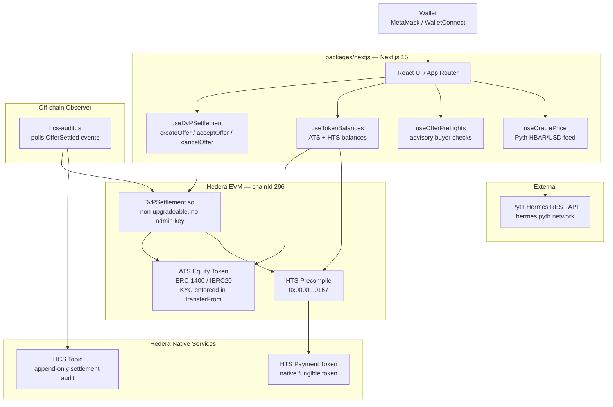
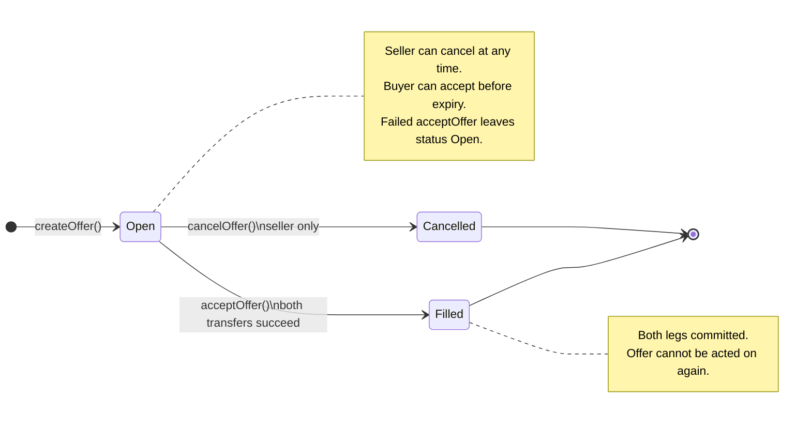
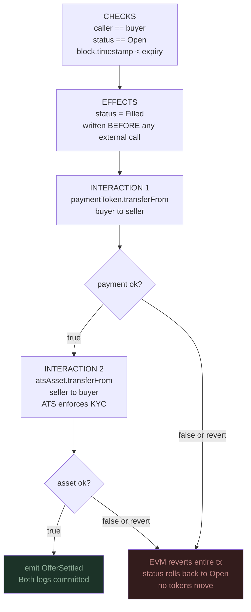

# Architecture

## Settlement sequence

```mermaid
sequenceDiagram
    autonumber
    participant S as Seller
    participant ATS as ATS Equity Token
    participant DVP as DvPSettlement
    participant HTS as HTS Payment Token
    participant B as Buyer

    Note over S,B: Off-chain agreement on terms

    S->>ATS: approve(dvp, assetAmount)
    Note over ATS: Allowance recorded. No balance lock.

    S->>DVP: createOffer(buyer, assetAmount, paymentAmount, expiry)
    DVP-->>S: emit OfferCreated(offerId)
    S-->>B: share offerId

    B->>HTS: approve(dvp, paymentAmount)

    B->>DVP: acceptOffer(offerId)

    rect rgb(15, 25, 48)
        DVP->>DVP: CHECKS: caller==buyer, status==Open, not expired
        DVP->>DVP: EFFECTS: status = Filled (CEI - before any external call)
        DVP->>HTS: transferFrom(buyer, seller, paymentAmount)
        HTS-->>DVP: true
        DVP->>ATS: transferFrom(seller, buyer, assetAmount)
        Note over ATS: KYC / eligibility enforced internally by ATS token
        ATS-->>DVP: true
    end

    DVP-->>B: emit OfferSettled(offerId, seller, buyer, amounts)
    Note over S,B: Both legs committed atomically in one EVM transaction
```



> If either `transferFrom` fails, the EVM reverts the **entire** transaction. Both legs roll back, the offer stays `Open`, no tokens move.

---

## System layers



---

## Offer state machine



---

## CEI execution flow

`acceptOffer` strictly follows Checks-Effects-Interactions:



---

## Trust boundaries

| Boundary | Model |
|---|---|
| Seller → DvPSettlement | Grants allowance; contract cannot pull more than approved |
| Buyer → DvPSettlement | Grants exact payment allowance; only designated buyer can `acceptOffer` |
| DvPSettlement → ATS Token | Calls `transferFrom` as approved spender; ATS enforces KYC internally |
| DvPSettlement → HTS Precompile | Standard IERC20 call at `0x0000000000000000000000000000000000000167` |
| Seller ↔ Buyer | No direct interaction; the contract enforces atomicity between them |

---

## Allowance model

Creating an offer does **not** reserve tokens. Balances and allowances are checked only at acceptance time by the token contracts.

A seller can create multiple open offers for the same balance. Only the first accepted will succeed — subsequent acceptances revert when the balance or allowance is depleted. This is documented in NatSpec on `createOffer`.

---

## Settlement rollback

| Failure condition | Result |
|---|---|
| Payment `transferFrom` reverts | Entire tx reverts. Status stays `Open`. No tokens move. |
| Payment `transferFrom` returns `false` | `require(paymentOk)` fails. Same result. |
| Asset `transferFrom` reverts (KYC, pause) | Entire tx reverts. Payment also rolled back. |
| Asset `transferFrom` returns `false` | `require(assetOk)` fails. Payment rolled back. |
| Reentrancy attempt | `ReentrancyGuard` reverts outer call immediately. |

---

## Pyth oracle (advisory)

```mermaid
flowchart LR
    PY["Pyth Hermes API\nhermes.pyth.network"] -->|GET price feed| H
    H["useOraclePrice hook\nbigint-only arithmetic\n5s timeout, 60s staleness"] -->|suggestedAmount: bigint or null| F
    F["CreateOfferForm\nadvisory display only\nform always submittable"] -->|seller sets paymentAmount| DVP
    DVP["DvPSettlement\nenforces no pricing"]

    style PY fill:#1a1a2e
    style DVP fill:#1a2e1a
```



---

## HCS audit trail

```mermaid
flowchart LR
    DVP["DvPSettlement\nemits OfferSettled"] -->|getLogs polling| A
    A["hcs-audit.ts\noff-chain observer"] -->|TopicMessageSubmitTransaction| T
    T["HCS Topic\nappend-only, no admin key\nordered and timestamped"] --> HS
    HS["HashScan\ntopic viewer"]

    style DVP fill:#1a2e1a
    style T fill:#1a1a2e
```



HCS message format (all amounts as decimal strings, no scientific notation):

```json
{
  "offerId": "1",
  "seller": "0xa542becd4d0549812d392127175aa199a3bb9fe9",
  "buyer": "0x75c925b0fe7ce447010725ccff65502a0d1c457d",
  "assetAmount": "100000000000000000000",
  "paymentAmount": "50000000",
  "txHash": "0x317c3c17e80a392bbab7732e6eb8bc21aee0fb797307017c72bd6b249196e02b",
  "timestamp": "2026-10-02T00:17:00.000Z"
}
```

---

## ATS Factory integration

Script 2 calls `deployEquity()` directly on the live ATS Factory contract using ethers.js (no browser wallet required). This deploys a real ERC-1400 equity token with `internalKycActivated: true`.

```mermaid
flowchart TD
    ENV["packages/hardhat/.env\nATS_ADMIN_PRIVATE_KEY\nATS_FACTORY_ADDRESS"] --> S2
    S2["2.provision-ats.ts\nethers.js signer"] -->|deployEquity struct| FAC
    FAC["ATS Factory Proxy\n0x5fA65CA30d1984701F10476664327f97c864A9D3"] -->|deploys| TOK
    TOK["ATS Equity Token\ninternalKycActivated: true\nERC-1400 / IERC20"] --> KYC
    KYC["grantKyc(seller)\ngrantKyc(buyer)"] --> ISS
    ISS["issue(seller, 1_000_000)"] --> DONE
    DONE["Setup state written\nATS_TOKEN_ADDRESS recorded"]

    style FAC fill:#1a1a2e
    style TOK fill:#1a2e1a
```



If the factory call reverts (e.g. admin account not registered), script 2 falls back to `MockATSToken` automatically and clearly labels it as a simulation.
