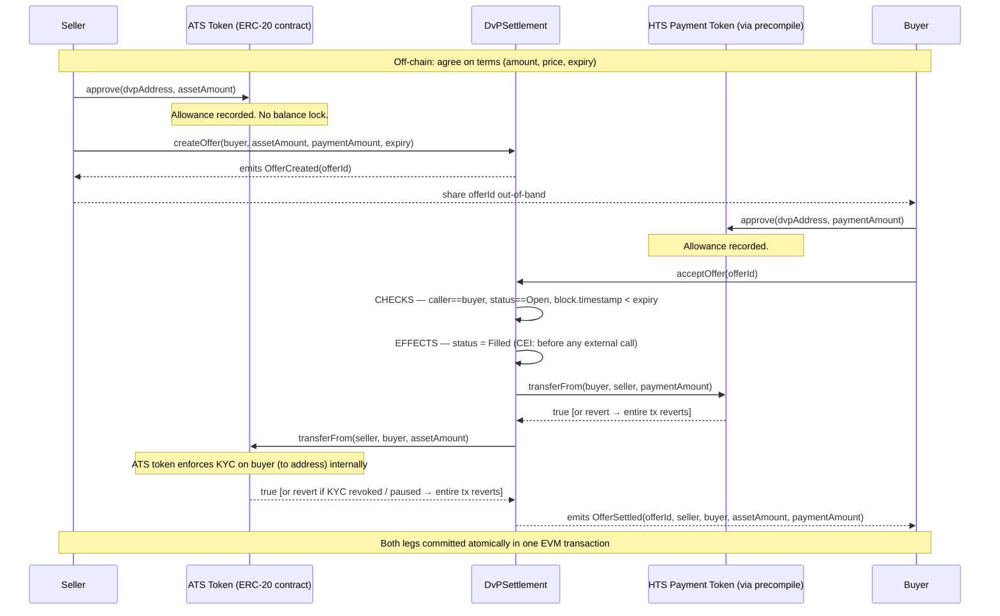

# Architecture

## Settlement flow



If either `transferFrom` reverts or returns `false`, the EVM reverts the entire transaction. The `require()` guards on both return values catch tokens that signal failure by returning `false` rather than reverting. The status write to `Filled` is also rolled back — the offer remains `Open`.

---

## Trust boundaries

| Boundary | Description |
|---|---|
| Seller → DvPSettlement | Seller grants allowance and creates offers. The contract cannot pull more than the approved amount. |
| Buyer → DvPSettlement | Buyer grants exact payment allowance. Only the designated buyer address can call `acceptOffer`. |
| DvPSettlement → ATS Token | Contract calls `transferFrom` as approved spender. ATS token enforces KYC/eligibility internally. |
| DvPSettlement → HTS Precompile | Contract calls `transferFrom` on the HTS precompile at `0x0000000000000000000000000000000000000167`. Standard ERC-20 call — no special trust. |
| Seller ↔ Buyer | No direct interaction. The contract enforces atomicity and authorization between them. |

---

## Allowance model

Creating an offer does **not** reserve tokens. The seller's balance and allowance are verified at acceptance time by the token contracts themselves.

Consequences:
- A seller can create multiple open offers for the same asset balance.
- Only the first offer accepted will succeed; subsequent acceptances revert when the balance or allowance is depleted.
- This is documented in NatSpec on `createOffer`.

---

## ATS KYC enforcement

When `DvPSettlement` calls `atsAsset.transferFrom(seller, buyer, assetAmount)`, the ATS token contract's own `transferFrom` logic checks whether the buyer (`to` address) has KYC/eligibility status. If eligibility was granted at offer creation but revoked before acceptance, the `transferFrom` call reverts and the entire settlement transaction reverts — no tokens move.

The settlement contract does not implement any eligibility logic. Compliance rules live entirely in the asset token.

---

## Settlement rollback

Rollback is handled entirely by EVM transaction semantics:

| Scenario | What happens |
|---|---|
| Payment `transferFrom` reverts | Entire tx reverts. Offer status stays `Open`. No tokens move. |
| Payment `transferFrom` returns `false` | `require(paymentOk)` fails. Entire tx reverts. No tokens move. |
| Asset `transferFrom` reverts (after payment succeeded) | Entire tx reverts. Payment transfer is also rolled back. No tokens move. |
| Asset `transferFrom` returns `false` | `require(assetOk)` fails. Entire tx reverts. Payment transfer rolled back. |

The offer status is set to `Filled` before any transfer call (CEI pattern). If the transaction reverts, that write is also rolled back — the offer remains `Open` and can be retried or cancelled.

---

## Unsupported configurations

| Configuration | What happens |
|---|---|
| ATS token with protected partitions | `transferFrom` on default partition may fail or behave unexpectedly. `acceptOffer` reverts. No tokens move. |
| ATS token globally paused | `transferFrom` reverts at the token level. `acceptOffer` reverts. No tokens move. |
| HTS payment token with custom fees | Effective transfer amount differs from requested amount. Not supported — do not use. |
| Rebasing payment token | Token balance changes post-transfer. Undefined behavior — not supported. |

---

## HTS precompile address

The HTS precompile is at `0x0000000000000000000000000000000000000167` on both Hedera Testnet (chainId 296) and Hedera Mainnet (chainId 295). Native HTS fungible tokens are accessible at their derived EVM address: `0x` + zero-padded hex of the token number. For example, HTS token `0.0.10816685` has EVM address `0x0000000000000000000000000000000000a50cad`.

`DvPSettlement` calls `transferFrom` on this address identically to any ERC-20 contract. The precompile handles the native HTS transfer internally.

---

## Pyth Network Oracle

`hooks/useOraclePrice.ts` fetches the HBAR/USD price from Pyth's Hermes REST API and computes an advisory suggested payment amount for the seller when creating an offer.

`
Pyth Hermes API (https://hermes.pyth.network)
      |  HTTPS GET /v2/updates/price/latest?ids[]=<feedId>
      v
useOraclePrice hook (Next.js client component)
      |  computeSuggestedAmount(rawPrice, expo, assetAmount) -- bigint only
      v
CreateOfferForm -- advisory suggestion below payment amount field
      |  seller can override -- form always submittable
      v
DvPSettlement.createOffer() -- enforces no pricing
`

The oracle is advisory-only and does not block settlement. Feed ID is configurable via `NEXT_PUBLIC_PYTH_FEED_ID`.
## HCS Audit Trail

An off-chain observer script (`scripts/hcs-audit.ts`) listens for `OfferSettled` events from the deployed `DvPSettlement` contract and submits a structured JSON message to a Hedera Consensus Service topic after each settlement.

```
DvPSettlement (EVM)
      │  OfferSettled event
      ▼
hcs-audit.ts (off-chain)
      │  TopicMessageSubmitTransaction
      ▼
HCS Topic (append-only, no admin key)
      │  Ordered, timestamped, tamper-evident
      ▼
HashScan topic viewer
```

This composes two native Hedera services: an EVM smart contract for atomic settlement enforcement, and HCS for immutable settlement record-keeping. The contract does not need to be modified — the observer reads public events.
